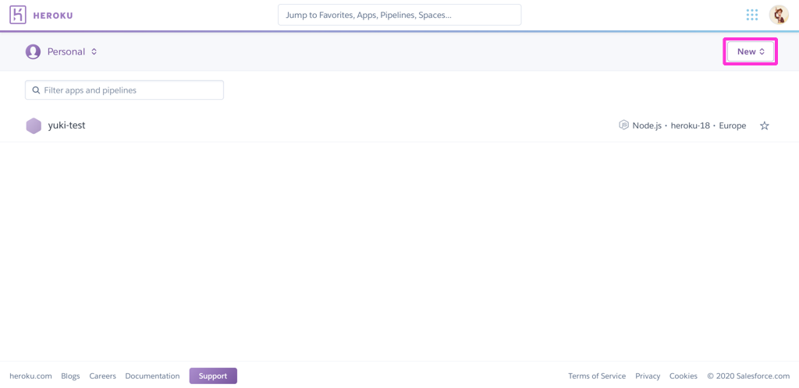
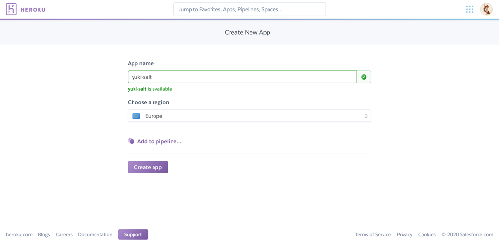
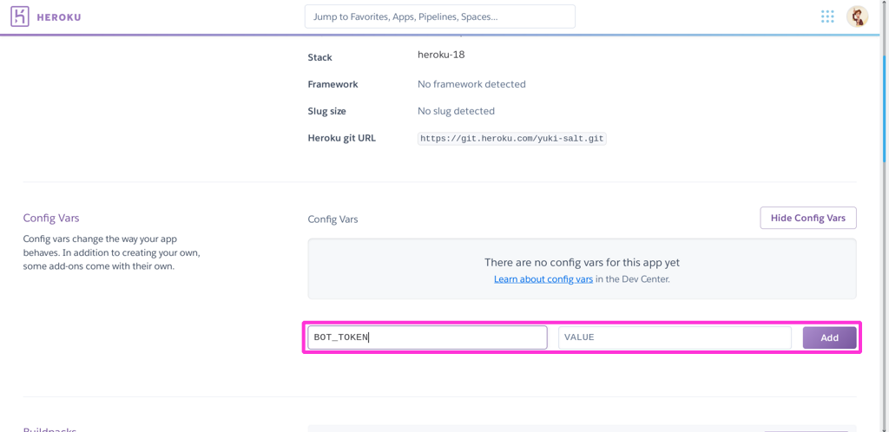
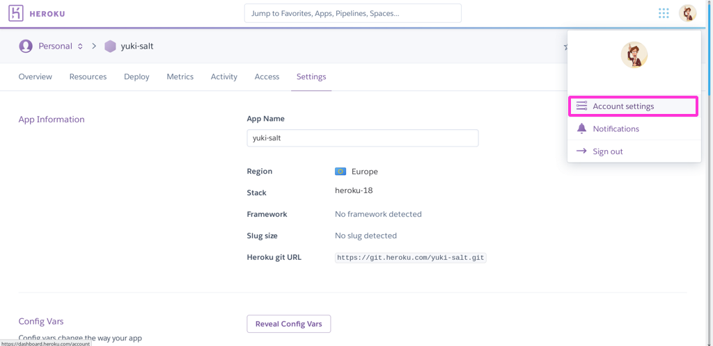
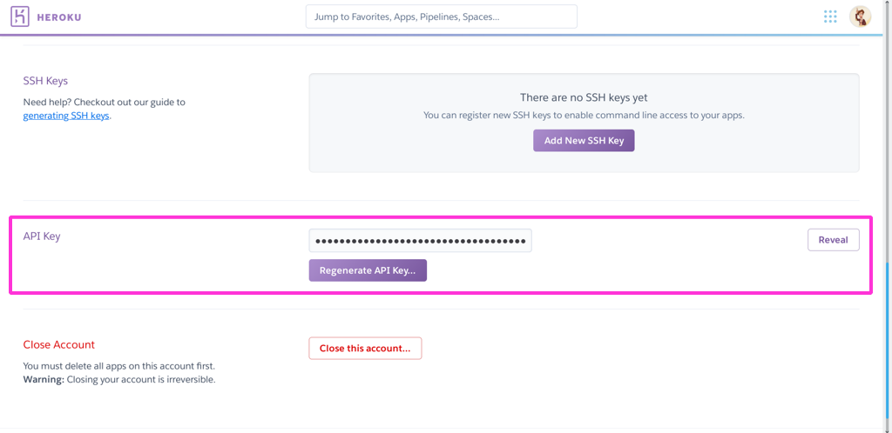
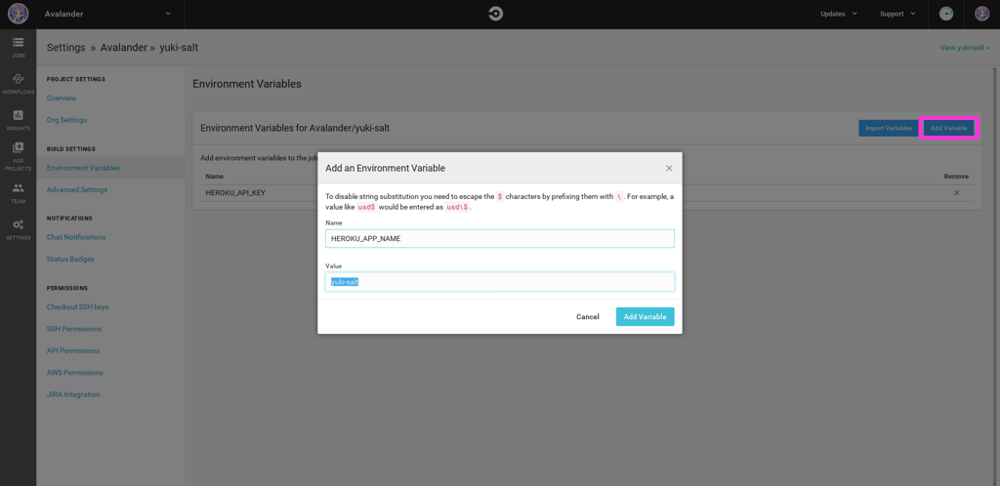

# Deploy Yuki to Heroku with CircleCI

## Create a new app in Heroku

To start, log in to [heroku.com](https://heroku.com).

In the dashboard, create a new application by clicking on the `New` button on the top right corner.



Choose an app name, set the region to Europe and click on `Create app`.



## Add bot token

We need to provide the `BOT_TOKEN` environment variable to heroku. Start by copying the same token we used in [the previous section](./add-bot-to-discord.md) to start the bot from the command line.

Once the app is created, go to the settings tab and scroll down until the `Config Vars` section. Then click on `Reveal Config Vars`.


Then add a new variable with the name `BOT_TOKEN`, and the bot token you got from Discord as value.



## Configure CircleCI to access Heroku

Before we jump into deploying to Heroku, CircleCI needs to know a couple of things about our Heroku app, namely the name and the API token.

To get the API token for Heroku, we go to our account settings in Heroku



And then scroll down to `API key`, where we can copy it from.



Next we go to our [CircleCI dashboard](https://circleci.com/dashboard) and click on the cog wheel next to our project.


Then we select `Environment variables` in the menu on the left side and add two variables:

`HEROKU_APP_NAME`, with the name we gave to our app in Heroku.

`HEROKU_API_KEY`, with the API token we've just copied.



## Update config.yml

Now we are ready to start deploying to Heroku from CircleCI. We need to update our configuration in `.circleci/config.yml` and add the workflow to deploy. Luckily enough, CircleCI has already some tools to deploy to Heroku, so we'll have to type less.

Let's begin by adding the `heroku` orb in the `orbs` object, under `node`.

```yml
orbs:
  node: circleci/node@1.1.6
  heroku: circleci/heroku@1.0.1
```

Now we will add a new workflow that will first build and test the code, and then deploy to heroku:

```yml
workflows:
  heroku-deploy:
    jobs:
      - build-and-test
      - heroku/deploy-via-git:
          requires:
            - build-and-test
          filters:
            branches:
              only: master
```

The job `heroku/deploy-via-git` comes from the `heroku` orb and does all the steps necessary to deploy to Heroku. It knows where to deploy thanks to the variables `HEROKU_APP_NAME` and `HEROKU_API_TOKEN` that we have set up previously.

Note that we have added a filter to deploy only from the master branch, since we don't want to deploy work in progress.

The complete `config.yml` file can be seen [here](../.circleci/config.yml).

If you merge this changes to your master branch in GitHub, you should see CircleCI run the tests and deploy to Heroku.

## Configure Heroku to run the bot

If we were deploying a web app, this is all the work we would need to do. Since Yuki is a bot, and it needs to be active not only to receive HTTP requests, we need to configure Heroku to handle that.

If you go back to your Heroku dashboard and go in to your app, you'll see that there are two dynos set up: a `web` one, which is enabled, and a `worker` one, which is disabled.


We need to disable the `web` dyno, since we are not deploying a web server, and enable the `worker` dyno. Click on `Configure dynos` and switch them both.


Now Yuki should be up and running, and if you go to your Discord server the bot should be active and you should be able to interact with it.

## About Heroku dynos

Heroku's free plan offers you a certain amount of free dyno hours, which means that you can have dynos running for up to that number of hours per month. `worker` dynos are active all the time, so if you want to save your free quota you might want to disable the `worker` dyno once you are done playing with the bot.

## Conclusion

This is everything we need to do to have our CI/CD pipeline set up. Now everytime we push to the GitHub repository the linter and the tests will be executed, and when we merge to master, the app will be deployed to Heroku automatically.